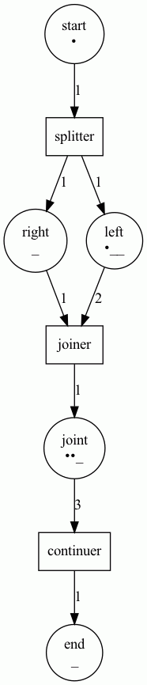
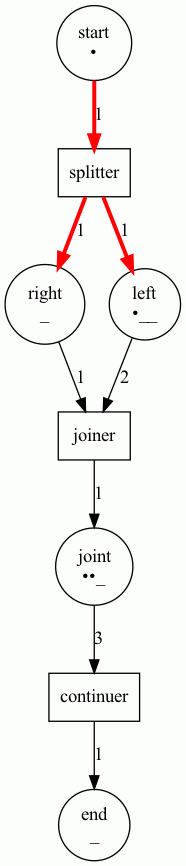

# MN8.Dev

## Draft - Product Description and Specification

### D@WN Introduction

**D@WN** is an implementation of the Decentralized Web Nod specification as provided by the DIF. Our D@WN  implementation serves as a _"Decentralized Service Bus"_ for building modular DApp's (Decentralised Applications) by combining SideChain and SSI solutions that allows developers to achieve the properties of **High Cohesion** and **Loose Coupling** that is the key feature of high quality software.

The concept of a Service Bus was formalised as an Enterprise Integration Pattern at the time when Service Oriented Architecture (SOA) emerged as a better alternative to monolithic enterprise systems. To this day Service Bus technologies form the back bone of large banking and financial systems with  large vendor system such as IBM MQ, TIBCo and Oracle Service Bus.

Even though Decentralized Ledger Technology has mitigated some of the <a href="https://en.wikipedia.org/wiki/Fallacies_of_distributed_computing">The 8 Fallacies of Distributed Computing</a>  DApp developers are still faced with  numerous challenges.

Our framework facilitates the creation and execution of business process workflows that utilizes:

* Autonomous Decentralised Identities (DID) that provides Authentication, Authorization and Non-repudiation to Individuals (SSI), Organizations (DAOs) and Things (IoT)
* Secure Asynchronous Communication using DIDComm
* Tokenization of assets based a standardized taxonomy that provides a composable blockchain agnostic token framework work creation and transfer of tokenized assets, commodities and attestations.
* Stateful orchestration of workflows, expressed as Coloured Petri-Nets
  
### Decentralised Identity and the DID-method

The concept of Decentralized Identities has been formalised and adopted as W3C standard. The following description from their website: _Decentralized identifiers (DIDs) are a new type of identifier that enables verifiable, decentralized digital identity. A DID refers to any subject (e.g., a person, organization, thing, data model, abstract entity, etc.) as determined by the controller of the DID. In contrast to typical, federated identifiers, DIDs have been designed so that they may be decoupled from centralized registries, identity providers, and certificate authorities. Specifically, while other parties might be used to help enable the discovery of information related to a DID, the design enables the controller of a DID to prove control over it without requiring permission from any other party. DIDs are URIs that associate a DID subject with a DID document allowing trustable interactions associated with that subject._

It might be helpful to think of DIDs in terms of the IP addresses that identifies a machine endpoint on the internet. The biggest difference is that these addresses are not issued or controlled by a central authority such as ICANN in the case of IP addresses, but rather by the individual itself.

A second crucial difference is that the DID comes with a cryptographic key pair (PKI). whilst centralized Certificate Authorities can optionally provide servers (DNS address) with a private public keys. This is where verifiable credentials allows DID addressees with the ability to associate credentials to your DID and have these credentials verified by the originator of the credential, to prove that the DID actually belongs to you.

#### DID-core and SSI

As mentioned earlier, Verifiable Credentials provide proof that you are the owner of you DID and its accompanying Private Key.

A typical SSI credential exchange consists of three roles, namely an issuer, holder and verifier. Depending on the context of a particular credential exchange, an identity owner (person, organisation, device etc.) may fulfill any of these roles. Each of these parties has a digital wallet in which all of their personal identifiable information (PII) is stored.

An identity owner can have multiple decentralised identifiers (DIDs) [67]. In fact, each digital connection which an identity owner makes online has its own private pairwise DID. This DID is a label for a secure encrypted communication channel between two parties, which does not directly reveal who is on either side. In this way SSI limits the ability of a third party to correlate a user’s activity online.

 

As the diagram shows, the most crucial piece of information that needs to be accessible on a public distributed ledger in order to enable the trust triangle, is the public DID (and associated public key) of the issuer. Theoretically, this public keystore could be any public utility or database, however, distributed ledgers offer unique properties that significantly enhances the scope, scalability and security of the trust ecosystems that can be built. These properties include:

* They are decentralised (not under the control of a single authority).
* They are tamper proof (immutable).
* They are chronologically ordered, keeping the public keys current and up to date by design.

This solves one of the biggest problems in existing public key infrastructure (PKI): providing a seamless and secure exchange of cryptographic keys between peers without requiring mediation by a central certificate authority.

Once the DID and public key information is written to the ledger, the issuer private key can be used to digitally sign verifiable credentials and issue them to a holder. The holder can then present cryptographic proof of the credential, which contains the issuer’s public DID. This DID can be used as a resource locator for retrieving the issuer public key from the ledger to decode and validate the information in the credential, without requiring any direct systems integration with the issuer. In fact, the issuer does not need to know about the verifier at all.

Even though the SSI trust triangle allows for technically verifying the source and validity of digital credentials through cryptographic trust, it still begs the simple question: How does the verifier know about and trust the issuer to begin with? The answer is good old fashioned human trust, in the form of a governance framework:

 Trust over IP and Governance and Technology

A governance framework is a set of business, legal and technical rules that governs how SSI infrastructure is used in a particular trust ecosystem [70]. The entity that creates and administers the framework is the governance authority for the ecosystem, and is trusted by its members.

Governance frameworks are key to how verifiable credentials can be adapted to any community and scale to work in any size trust ecosystem: be it neighborhoods, universities, business consortia, entire industries, nation states or the internet as a whole. They make a verifier’s job easier by stipulating which issuers will issue which credentials, under which policies to which holders with what level of assurance etc. This is the information a verifier needs to make their own trust decisions about relying on a holder’s proof of a particular credential.

A popular analogy for illustrating the scalability enabled by this approach is credit card networks: Mastercard or Visa act as governance authority for a payment network: they partner with financial institutions like banks, credit unions etc. (issuers) that issue payment cards (credentials) to cardholders, who use those credentials to prove financial means to merchants (verifiers). This example illustrates how the largest trust networks in the world follow this basic model.

In May 2020, the Linux Foundation announced that it would be hosting the Trust over IP (ToIP) Foundation with the intention of simplifying and standardising how trust is established online. The ToIP charter is to “define a complete architecture for Internet-scale digital trust that combines cryptographic trust at the machine layer with human trust at the business, legal and social layers.” Towards this end, they have defined the dual ToIP .

The ToIP stack is a four-layered architectural model for standardising SSI-powered digital trust infrastructure. A detailed discussion of the ToIP stack can be found in the ToIP foundation’s whitepaper.

#### Sidetree

Without a central administrator, it is incumbent on the identity holder to securely manage his own DID, DID-Document and Cryptographic Keys. The Sidetree specification from the Decentralised Identity Foundation (DIF) provides a definition of how to achieve this.


The Sidetree DID-method is not anchored to a specific blockchain instance, like is the case with Sovrin. It allows an implementation  that utilize any existing decentralized anchoring system (e.g. Bitcoin, Ethereum, distributed ledgers, witness-based approaches) while being as open, public, and permissionless as the underlying anchoring systems they utilize. It can be depicted as follows:


Our Sidetree-based DID-method implementation runs as peer-services as part of the D@WN's decentralised nodes and is anchored to the Cardano or Ergo blockchain platform while using IPFS as the Content Addressable Store.

### DIDComm messaging support

The status quo of internet based services creates an asymmetry between institutions and ordinary people. The former maintain certificates and always-connected servers, and publish APIs under terms and conditions they dictate; the latter suffer with usernames and passwords, poor interoperability, and a Hobson’s choice between privacy and convenience.

Using DIDComm, individuals on semi-connected mobile devices become full peers of highly available web servers operated by IT experts. Registration is self-service, intermediaries require little trust, and terms and conditions can come from any party.

DIDComm Messaging  provides a secure, private communication methodology built atop the decentralized design of DIDs. It enables higher-order protocols that inherit its security, privacy, decentralization, and transport independence. Examples include exchanging verifiable credentials, creating and maintaining relationships, buying and selling, scheduling events, negotiating contracts, voting, presenting tickets for travel, applying to employers or schools or banks, arranging healthcare, and playing games. Like web services atop HTTP, the possibilities are endless; unlike web services atop HTTP, many parties can participate without being clients of a central server, and they can use a mixture of connectivity models and technologies. And these protocols are composable into higher-order workflows, as supported by our State Machine.

D@WN uses Asynchronous messaging as the foundation for integration solution because its architectural style acknowledges the challenges of distributed communication. However, many interactions between systems extend beyond sending a single, stateless message: a request may expect a response; a handshake or authentication are needed first; a reservation is confirmed or expires.

DID Core and DIDComm provides the platform for peer to peer communication between people organizations and things:


D@WN also uses DIDComm for its transport layer:
_%26_DIDComm_(1of2).jpg)

### Tokens: Templates, Classes and Instances

A Token in the Decentralized Ledger domain serves as representation of an asset/liability, commodity/currency, right/proof. These tokens are normally stored in a crypto-wallet which provides secure access to the owner(s). Creation (minting), transfer and use (burning) of tokens are reflected on the decentralized ledger of a specific block-chain. D@WN as a platform is blockchain agnostic.

There are 2 major Token types namely, Fungible (interchangeable) and Non-Fungible (distinct). A token representing a commodity such as a bag of potatoes or 1 kWh energy is fungible - the one is the same as the other and a potential buyer does not care which specific instance het gets -  while a token representing an asset such as a car or computer is Non-Fungible. (There is a hybrid type of token that represents fungible and non-fungible aspects in a specific context)

Tokens has wide applicability far beyond proof of ownership of over-hyped NFT Artworks; e.g. Tokens can be used to transfer Voting Rights, Entrance (Ticket), Attestations, etc.

#### Behaviour

D@WN supports **tokens** that adheres to the Token Taxonomy Framework as set out by the Interwork Alliance. It defines **behaviours** as capabilities or restrictions that applies to a token class along with Properties of a token, as information or data it contains.

The framework provides an extensible set of Behaviours, such as:

* Transferable/Non-Transferable: ability to transfer the token from one owner to the next
* Divisible/None-divisible(Whole): Decimal places a token can be divided into
* Singleton: Only one version of this token can ever exist — an art work;
* Mintable: Token class that can replenished (according to some constraints) e.g. as more commodities represented by the token are produced — energy produces, potatoes grown;
* Role-support: the token provides role-definition attributes that constrain specific actions;
* Burnable: Tokens that can be removed from supply once consumed/transformed;
* Attestable: return a cryptographic proof of authenticity, validity and provenance of  a source document
* Credible: When burned or retired a credit token is created  on its behalf;
* Delegable: Behaviours of this token can be invoked by another appointed party;
* Encumbrable: Execution of behaviours related to this token is prevented while encumbered;
* Burnable : Support the burning or decommissioning of token instances of the class
* Compliant : comply with legal requirements, e.g. KYC and AML.
* Encumberable : implements this behavior will have restrictions preventing certain behaviors like transferable, burnable, etc. from working while it is encumbered.
* Fabricteable : Unique tokens can be fabricated from a base tokenization
* Holdable : Every token instance has an owner. A hold specifies a payer, a payee, a maximum amount, a notary and an expiration time. When the hold is created, the specified token balance from the payer is put on hold. The hold can only be executed (partially or the full amount) by the notary, which triggers the transfer of the tokens from the payer to the payee.
* Issuable : This token has a controlling a central party, the issuer, is the only one able to create/transfer/destroy tokens.
* Logable : Record log entries from its owner with a generic payload.
* Offsetable : A token class that implements this behavior is burned or retired with its value being applied to offset another balance. Once a token is offset, it can no longer be used
* Overdraftable : This token grants an overdraft credit limit to a wallet owner, who can then make transfers or create holds without the required (positive) balance.
* Pauseable : Pausable is an influencing behavior that can be applied to other behaviors in the Token.
* Processable : A token class that implements this behavior is burned or retired when the next token is issued in a supply chain of tokens.
* Redeemable : This behavior only applies to unique tokens. Redeemed tokens can no longer be spent.
* Revocable : This token has a controlling a central party, the issuer, is able to retire/burn tokens that it has issued, regardless of owner.
* Roles : A token can have behaviors that the class will restrict invocations to a select set of parties or accounts that are members of a role or group.  This is a generic behavior that can apply to a token many times to represent many role definitions within the template. This behavior will allow you to define what role(s) to create and what behavior(s) to apply the role to in the TemplateDefinition.
* UniqueTransferable : The unique transferable behavior provides the owner the ability to transfer the ownership to another party or account of one or more unique tokens owned. This behavior and does not transfer the tokens themselves. Rather, new tokens are created by the transfer transaction. Because this behavior works with unique tokens, the invocation request can take multiple tokens as inputs to be transferred. The quantity of the assets being transferred to the recipients of the transaction needs to be the same quantity as the input tokens. If you do not want to transfer the entire quantity of the asset represented by the token, you can transfer a portion of the asset and the transaction will automatically make you the owner of the remaining balance. Using the example above, if only spend 50 dollars of the 100 dollar token, the transfer transaction will automatically create a new token worth 50 dollars with you as the owner. All input tokens of the transaction need to be of the same type and the tokens being transferred need to belong to the transaction initiator and are unspent.

#### Properties

Properties of a token are used to define the information or data a token contains about itself and to record its activities. Some properties are set when the token class is created from a template, like its name and owner while others are set and updated over a token’s lifetime. How a property value is set determines what type of property it is.

### Stateful orchestration of workflows, expressed as Coloured Petri-Nets

The D@WN State Engine handle consecutive Smart Contract invocations (the dApp Protocol) within the context of a encapsulating state machine (FSM) as expressed by a Petri Net and executed by an off-chain dApp-container.

In general Petri-Nets is a directed acyclic graph that maps Places (circles) to Transitions (rectangles) and Transitions to Places via Arcs (arrows).
It is well suited for describing the flow of concurrent processes. This maps perfectly to the of Stages (Places) and Actions (Transitions)

Petri Nets are more concise than other process flow descriptions (like UML or BPMN) in that they have an exact mathematical definition of their execution semantics, with a well-developed mathematical theory for process analysis. Bounded Petri Nets exhibits Categorical Semantics in the way that **concatenable processes as strict Monoidal categories** model Net computations [[1]](#1) [[2]](#2)

Because of its Markov property - states depend only on the current marking -  Stochastic Petri Nets are also used for validating and testing the Liveness, Boundedness and Reachability of distributed networks.

From the proposal perspective, Petri Nets are directed graphs consisting of Places(Stages), Transitions(Actions) and Arcs(Transaction). It models state-transitions of (concurrent) processes.
It is easy to see (if you are that way inclined) that Petri Nets form a Category of Petri.  

An example of how to construct a PetriNet using a builder-pattern in Scala ( Using a Petri Net library (Castanet))

```scala
val p1 = Place(1, "start", 1)
val p2 = Place(2, "left", 3)
val p3 = Place(3, "right", 1)
val p4 = Place(4, "joint", 3)
val p5 = Place(5, "end", 1)

val t1 = Transition(6, "splitter", (l: LinkableElement) => println(l))
val t2 = Transition(7, "joiner", (l: LinkableElement) => println(l))
val t3 = Transition(8, "continuer", (l: LinkableElement) => println(l))

val b1 = PetriNetBuilder().addAll(ListSet(p1, p2, p3, p4, p5))
val b2 = n.addAll(ListSet(t1, t2, t3))
val b3 = n2
  .add(Weighted(1, 6, 1))
  .add(Weighted(6, 2, 1))
  .add(Weighted(6, 3, 1))
  .add(Weighted(2, 7, 2))
  .add(Weighted(3, 7, 1))
  .add(Weighted(7, 4, 1))
  .add(Weighted(4, 8, 3))
  .add(Weighted(8, 5, 1))
val petrinet = b3.build()
```

State is attributed to the Petri Net through Markers that associate a BitVector (scodec.bits) with a specific Place.
The setting of a bit is in turn determined by the success of the ErgoScript execution.

```scala
val m1 = Markers(pn)
val m2 = m1.setMarker(Marker(1, bin"1"))
val m3 = m2.setMarker(Marker(2, bin"1")).setMarker(Marker(4, bin"11"))
```



For a given set of Markers (current state) the PetriNet can be asked to step through to the next state (set of markers) as indicated by the guards placed on the Arcs that join Places and Transitions.

A ColouredPetriNet is traversable using a state monad to step from an initial state

The resulting state changes can be visualized with a PetriPrinter.

```scala mdoc
    PetriPrinter(fileName = "petrinet1", petriNet = pn).print(Option(m3))
    val steps: State[Step, Unit] =
      for
        p1 <- pn.step
        p2 <- pn.step
        p3 <- pn.step
      yield (
        PetriPrinter(fileName = "petrinet2", petriNet = pn).print(Option(p1)),
        PetriPrinter(fileName = "petrinet3", petriNet = pn).print(Option(p2)),
        PetriPrinter(fileName = "petrinet4", petriNet = pn).print(Option(p3))
      )
    steps.run(Step(m3, true, 1)).value
```



We derive the set of Transitions (Actions) from  ErgoScript files that controls  the business flow.
These Transitions are specified using a Dhall/JSON format list:

```dhall
[
  {
      id = 2 
    , name = "testTransition"
    , action = {
          packageName = "packageName1"
        , name = "contractName1"   
        , contract = 
          {
            name = "ergoScript1"
          , input = [inbox1, inbox2...]
          , output = [outbox1, outbox2...]
          } 
    }
    , action = {name = "contractName2"
          , input = "inbox3"
          , output = "outbox3"
          }
  }
]
```

Transitions change the States of the Workflow as described by a list of Places (Stages):

```dhall
  [{
    id = 1 
    , name = "place1"
    , capacity = 2
  }]
  ```

### Patterns

1. A business analyst should  create a dApp Protocol by joining Places (States) and Transitions with Arcs
2. Configuration of a specific instance of a dApp can be programmatically created or be informed by the UI connecting to the headless dApp through a DIDComm messaging and GRPC/HTTP API
3. Smart Contract templates will allow reuse and create a possible market place of tested Contracts
4. Validation of dApp can be done in terms of Liveness, Boundedness and Reachability
5. Design patterns will be supported by the Petri Net:


## References

<a id="1">[1]</a>
Sassone, V.. (2006). On the category of Petri net computation. 10.1007/3-540-59293-8_205

<a id="2">[2]</a>
Ermel, Claudia & Martini, Alfio. (1996). A Taste of Categorical Petri Nets. 