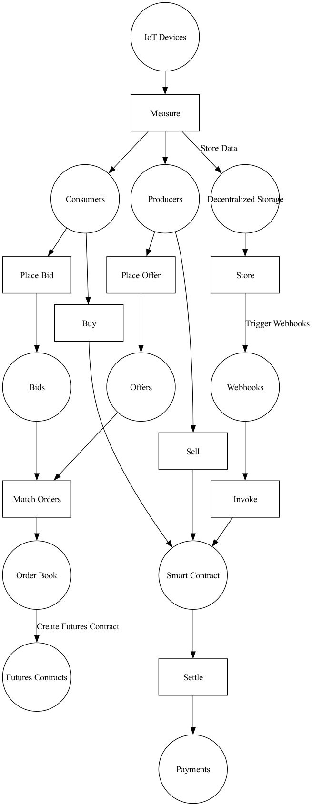
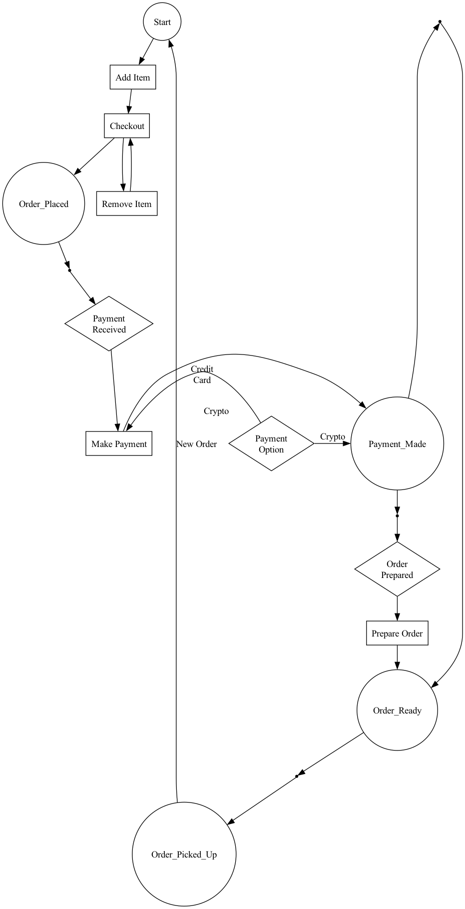

# D@WN - DIDx Decentralised Web Node Implementation

<!-- @import "[TOC]" {cmd="toc" depthFrom=1 depthTo=6 orderedList=false} -->

<!-- code_chunk_output -->

- [D@WN - DIDx Decentralised Web Node Implementation](#dwn---didx-decentralised-web-node-implementation)
  - [Overview](#overview)
  - [Stateful orchestration of workflows, expressed as Coloured Petri-Nets](#stateful-orchestration-of-workflows-expressed-as-coloured-petri-nets)
  - [Use of CPN's to implement custom protocols in a DWN](#use-of-cpns-to-implement-custom-protocols-in-a-dwn)
  - [IOT use case: Web Hooks provies event triggers from Data Storage and DIDComm Messaging](#iot-use-case-web-hooks-provies-event-triggers-from-data-storage-and-didcomm-messaging)
  - [Web Hooks for event triggers from DWN Data Storage and DIDComm Messaging in retail](#web-hooks-for-event-triggers-from-dwn-data-storage-and-didcomm-messaging-in-retail)
  - [True Privacy Preserving AI with DWN](#true-privacy-preserving-ai-with-dwn)
  - [Lead Generation with DWN](#lead-generation-with-dwn)
  - [D@WN Revenue Model](#dwn-revenue-model)

<!-- /code_chunk_output -->

## Overview

A Decentralized Web Node (DWN) is a personal and application data storage and message relay node, as outlined in the Decentralized Identity Foundation's (DIF) Decentralized Web Node specification. DWNs enable users to have control over their data and communication, fostering a more secure and privacy-preserving environment. Users can operate multiple nodes that synchronize data between them, ensuring data redundancy, availability, and resilience.

 In the context of retail and IoT use cases, DWNs provide a flexible and scalable data storage and message relay mechanism that allows entities to exchange messages and data, and to store, discover, and fetch data related to various credential, app, or service flows.

As W3C adopted standards, Decentralized Identifiers (DIDs), DID documents, and DID Communication (DIDComm) are key components in Decentralized Web Nodes (DWNs) that enable secure and decentralized identity management and communication between entities. DWNs enable users to have control over their data and communication, fostering a more secure and privacy-preserving environment. Users can operate multiple nodes that synchronize data between them, ensuring data redundancy, availability, and resilience.

1. Decentralized Identifier (DID): A DID is a globally unique identifier that allows individuals, organizations, and devices to establish and manage their digital identities in a decentralized manner. DIDs are created, resolved, and managed on decentralized networks such as blockchain, distributed ledgers, or other decentralized systems. In the context of DWNs, DIDs enable entities to interact securely and privately without relying on centralized identity providers.

2. DID Document: A DID document is a machine-readable JSON-LD file that contains the public keys, authentication methods, and service endpoints associated with a specific DID. It enables the verification of the DID owner's identity and the establishment of secure communication channels. Within DWNs, DID documents help facilitate trust between entities and ensure that interactions are secure and authenticated.

3. DID Communication (DIDComm): DIDComm is a protocol for secure, privacy-preserving, and authenticated communication between entities using DIDs and DID documents. It allows entities to exchange encrypted messages, establish secure connections, and perform various tasks such as authentication, authorization, and data sharing. In the DWN ecosystem, DIDComm plays a critical role in enabling secure and privacy-preserving communication between nodes, devices, and users.

 A Decentralized Web Node (DWN) is a versatile and powerful component in the decentralized ecosystem, providing users with a decentralized solution for personal and application data storage and message relay. By using multiple nodes that replicate data between them, users can ensure data redundancy, availability, and resilience. DWNs empower users to maintain control over their data and communication while fostering a more secure, private, and interoperable environment. 

Key features of DWNs include:
1. Decentralized data storage: DWNs provide a decentralized approach to storing personal and application data, eliminating the need for centralized data storage providers. This increases users' control over their data, reduces the risk of data breaches, and enhances privacy.

2. Message relay: In addition to data storage, DWNs also serve as message relay nodes, enabling secure and encrypted communication between users, devices, and applications. This allows for privacy-preserving communication and ensures that messages are transmitted securely across the network.

3. Data replication: Users can operate multiple DWNs that replicate their data between them, ensuring that their data is backed up and available across various nodes. This redundancy increases data availability and resilience, protecting users against data loss in case of node failure or network issues.

4. Interoperability: The DIF Decentralized Web Node specification ensures that DWNs are built using standardized protocols and interfaces, enabling seamless communication and data exchange between nodes, regardless of the underlying technology or infrastructure. This interoperability fosters a more collaborative and open ecosystem.

5. User control: By utilizing DWNs, users have greater control over their data, as they can decide where to store their data, who to share it with, and how to manage access. This empowers users to exercise their data sovereignty and privacy rights.

By incorporating protocol definitions and web hooks into their design, Decentralized Web Nodes facilitate robust, secure, and interoperable communication within the decentralized ecosystem. These features enhance the user experience, streamline data exchange, and allow for more efficient and responsive interactions between nodes, devices, and applications.

1. Protocol definition: DWNs follow standardized protocol definitions to ensure seamless communication and data exchange between nodes. These protocols define the rules and requirements for exchanging information, enabling consistent and reliable interactions across the decentralized ecosystem.

2. Web hooks: DWNs utilize web hooks, which are event-driven mechanisms that enable asynchronous communication between nodes, services, or applications. Web hooks allow DWNs to register listeners for specific events and receive notifications when those events occur. This provides an efficient way to trigger actions or updates in response to events, such as changes in data or the completion of a transaction.

In the realm of IoT, devices are constantly generating metrics and readings, such as sensor data and device status information. DWNs can serve as the backbone for the storage and communication of this data, enabling IoT devices to publish their metrics and readings as events in a decentralized network. Other components in the DWN, such as data storage systems, smart contracts, or services, can then register as listeners for these events and process the IoT device data as required. This event-driven, decentralized approach allows for real-time notifications, efficient data exchange, and enhanced system responsiveness, fostering a more dynamic and interconnected IoT ecosystem.

As a practical example for the application of DWNs, concider e.g. in the retail industry, point of sale (POS) devices and payment gateways play a crucial role in generating and processing transaction data, including receipts, payment details, and other relevant information. DWNs can facilitate the storage and exchange of this data, allowing retail businesses to securely manage their transaction records, analyze sales trends, and improve inventory management without relying on centralized infrastructure or provider-specific solutions. By utilizing Decentralized Identifiers (DIDs) and a mesh-like datastore construction, DWNs enable retail entities to operate multiple nodes that sync to the same state across one another, ensuring seamless and secure data access and management.

In summary, Decentralized Web Nodes are revolutionizing the way entities store, manage, and exchange data in various digital activities, including retail and IoT use cases. By providing a decentralized, secure, and adaptable solution for data storage and message relay, DWNs empower entities to operate without reliance on location or provider-specific infrastructure, interfaces, or routing mechanisms, promoting a more resilient and flexible digital landscape.

## Stateful orchestration of workflows, expressed as Coloured Petri-Nets

A Petri Net is a mathematical modeling tool used for the representation and analysis of concurrent systems. The main components of a Petri Net include:

1. Places: Represent the state of a system, depicted as circles. Each place can hold tokens, which signify the current status of a process or resource.
2. Transitions: Represent events or actions that can change the state of the system, depicted as rectangles. A transition is enabled when all its input places have the required number of tokens.
3. Arcs: Represent the flow of control and resources in the system, depicted as arrows. Arcs connect places to transitions and transitions to places, indicating the direction of the flow.

Coloured Petri Nets (CPNs) are an extension of the basic Petri Net model that introduces the concept of "colours" or data types to the tokens. This allows for a more compact representation of complex systems with multiple resources or process instances. CPNs can be used to model and analyze a wide range of systems, including distributed systems, communication protocols, and concurrent software processes.

In a Coloured Petri Net, tokens have an associated data value, or "colour", which belongs to a specific data type. The data types can be as simple as integers or as complex as user-defined data structures. The introduction of colours makes it possible to distinguish between different instances of tokens, allowing for a more concise representation of systems with a large number of similar elements.

The main components of a Coloured Petri Net include:

1. Coloured Places: Similar to standard places, but each coloured place is associated with a specific data type, constraining the type of tokens that can reside in the place.
2. Coloured Transitions: Like standard transitions, but with input and output arc expressions that define the required colours of tokens for the transition to be enabled and the resulting colours of tokens produced after firing the transition.
3. Coloured Arcs: Connect coloured places to coloured transitions and vice versa, with arc expressions that describe the flow of tokens with specific colours between places and transitions.

Coloured Petri Nets maintain the formal semantics of standard Petri Nets, allowing for the analysis of properties such as liveness, boundedness, and reachability. However, CPNs also support additional analysis techniques tailored to systems with data dependencies, such as state space exploration and simulation.

Moreover, Coloured Petri Nets can be combined with other extensions, such as timed or stochastic Petri Nets, to model systems with both data and time dependencies, making them an even more powerful and versatile tool for the analysis of concurrent systems.

## Use of CPN's to implement custom protocols in a DWN

Using Petri Nets, including Coloured Petri Nets (CPNs), in the design and implementation of custom protocols for decentralized web nodes can be an effective approach for ensuring correct concurrent behavior, data flow, and resource management. Here's a high-level overview of the steps you can follow to implement custom protocols according to your specifications using Petri Nets:

1. Requirement analysis: Start by gathering and documenting the requirements of your custom protocol. This includes understanding the desired functionality, performance goals, security measures, and any other relevant aspects.

2. Petri Net modeling: Develop a Petri Net model (or a Coloured Petri Net model, if data types are involved) that captures the behavior of your custom protocol. Model the states, transitions, and arcs to represent the protocol's operations, data flows, and control flows. This step will help you to visually and formally describe the concurrent processes involved in your protocol.

3. Protocol validation: Analyze the Petri Net model to ensure that it meets the desired properties, such as liveness, boundedness, and reachability. This analysis will help you identify potential issues or inefficiencies in your protocol design, allowing you to refine the model as needed.

4. Protocol implementation: Once the Petri Net model is validated, use it as a blueprint for implementing your custom protocol. Translate the model's components (places, transitions, and arcs) into appropriate data structures, algorithms, and functions in your chosen programming language. Ensure that the implementation follows the concurrency rules and data flow constraints defined in the Petri Net model.

5. Testing and verification: Test your implemented protocol against various scenarios and edge cases to ensure that it behaves as expected. You can also use formal verification techniques to prove the correctness of your implementation, especially in critical systems where reliability is crucial.

6. Deployment and integration: Deploy your custom protocol within the decentralized web nodes and integrate it with the other components of your system. Monitor the performance and behavior of your protocol in real-world conditions to ensure that it meets the requirements and expectations.

By following these steps, you can leverage the power of Petri Nets to design and implement custom protocols for decentralized web nodes according to your specifications. This approach provides a rigorous foundation for understanding and reasoning about the behavior of your protocol, ensuring that it exhibits the desired properties and operates correctly in a concurrent environment.

## IOT use case: Web Hooks provies event triggers from Data Storage and DIDComm Messaging

In a decentralized web network (DWN) where IoT devices primarily act as publishers of their metrics and readings, the WebHook pub-sub mechanism can still be employed to facilitate effective communication between the devices and other components in the system, such as DWN Data Storage and DIDComm Messaging. Here's how the process would work in this scenario:

1. IoT devices as publishers: Each IoT device is responsible for collecting metrics and readings, such as sensor data or device status information. The devices can publish these metrics and readings as events to the DWN WebHooks pub-sub system.

2. Event registration: Other components in the DWN, such as data storage systems, smart contracts, or services, can register as listeners for events published by the IoT devices. They can subscribe to specific types of events or filter events based on certain criteria, such as device type or location.

3. Event publication: When an IoT device has new metrics or readings to share, it publishes the data as an event to the WebHook pub-sub system. The system then distributes the event to all registered listeners that have subscribed to the corresponding event type or match the filtering criteria.

4. Event processing: Upon receiving an event notification from the WebHook pub-sub, the subscribed components can process the IoT device data and take appropriate actions. This may include storing the data in DWN Data Storage, analyzing the data for trends or anomalies, triggering actions in smart contracts, or initiating further communication through DIDComm Messaging.

5. Event acknowledgment: After processing the event, the component can acknowledge the receipt and processing of the event back to the WebHook. This acknowledgment can include additional information, such as the result of the processing or any error messages encountered.

By utilizing the WebHook pub-sub mechanism in a DWN with IoT devices as publishers of metrics and readings, you can enable real-time, event-driven communication between the devices and other components in the system. This approach ensures efficient data exchange and allows the system to react to changes in device data, enhancing the overall capabilities of the DWN.

## Web Hooks for event triggers from DWN Data Storage and DIDComm Messaging in retail

Point of sale (POS) devices in retail stores and payment gateways for online stores can also act as publishers of data in a decentralized web network (DWN) using the WebHook pub-sub mechanism. This allows for real-time event-driven communication and efficient data exchange between the publishers and various components in the system, such as data storage, analytics services, smart contracts, and DIDComm Messaging.

Here's how the process would work with POS devices and payment gateways as data publishers:

1. Data generation: POS devices in retail stores and payment gateways for online stores generate transaction data, including receipts, payment details, and other relevant information, as customers make purchases.

2. Event registration: Components in the DWN, such as data storage systems, analytics services, smart contracts, or other services, can register as listeners for events published by the POS devices and payment gateways. They can subscribe to specific event types or filter events based on certain criteria, such as store location or transaction amount.

3. Event publication: When a POS device or payment gateway has new transaction data to share, it publishes the data as an event to the WebHook pub-sub system. The system then distributes the event to all registered listeners that have subscribed to the corresponding event type or match the filtering criteria.

4. Event processing: Upon receiving an event notification from the WebHook pub-sub, the subscribed components can process the transaction data and take appropriate actions. This may include storing the data in DWN Data Storage, analyzing the data for sales trends, triggering actions in smart contracts, or initiating further communication through DIDComm Messaging.

5. Event acknowledgment: After processing the event, the component can acknowledge the receipt and processing of the event back to the WebHook. This acknowledgment can include additional information, such as the result of the processing or any error messages encountered.

By leveraging the WebHook pub-sub mechanism in a DWN with POS devices and payment gateways as publishers of transaction data, you can enable real-time, event-driven communication and efficient data exchange between the publishers and other components in the system. This approach allows the system to react to changes in transaction data, enhancing the overall capabilities of the DWN and supporting a wide range of use cases, such as sales analytics, inventory management, and customer relationship management.

## True Privacy Preserving AI with DWN

In the context of Decentralized Web Nodes (DWNs) and Privacy-Preserving AI, applying the AI techniques to only the client's own data (a sample of 1) allows for highly personalized experiences while maintaining strict privacy. This approach ensures that the customer's data is used exclusively for their benefit, without sharing or aggregating it with other users' data.

Here's how this sample of 1 approach works with DWNs and Privacy-Preserving AI:

1. Individual data storage: Each customer's retail data, such as purchase history, preferences, and browsing behavior, is securely stored in their own DWN. This decentralized storage approach keeps the data isolated and ensures its confidentiality.

2. Personalized AI models: Privacy-Preserving AI techniques, such as secure multi-party computation or homomorphic encryption, can be applied to the client's data within their own DWN. This allows for AI models to be trained and fine-tuned based on the individual's data, resulting in highly personalized recommendations and insights.

3. Enhanced personalization: With the insights derived from the AI models trained on the client's own data, retailers can provide highly tailored shopping experiences, such as personalized product recommendations, targeted promotions, and customized user interfaces, which cater specifically to the individual's preferences and needs.

4. Privacy protection: Since the AI models are applied only to the client's data within their own DWN, their personal information is not shared or aggregated with other users' data. This ensures that the customer's privacy is protected while still benefiting from data-driven personalization.

5. Compliance with privacy regulations: The sample of 1 approach, combined with Privacy-Preserving AI techniques, helps retailers comply with data protection regulations, such as the General Data Protection Regulation (GDPR), by limiting data usage to the individual's own data.

In summary, using Decentralized Web Nodes to apply Privacy-Preserving AI on a sample of 1 allows retailers to offer highly personalized shopping experiences without compromising customer privacy. This approach ensures that the customer's data is used exclusively for their benefit, creating a more meaningful retail experience while adhering to strict privacy standards.

## Lead Generation with DWN

In a scenario where clients' data is stored in Decentralized Web Nodes (DWNs) storage, the lead generation service can utilize the DWN's storage and triggers to obtain relevant information for identifying potential insurance customers based on their high-value purchases.

Here's how the data collection process can work using DWN storage and triggers:

1. DWN storage: Clients' data, such as demographic information, purchase history, and preferences, is securely stored in the DWN storage. This decentralized approach ensures data privacy and compliance with data protection regulations.

2. Event registration: The lead generation service registers as a listener for specific events related to high-value purchases within the DWN network. This can be done by subscribing to event types or filtering events based on certain criteria, such as purchase amount or item category.

3. Event triggers: When a client makes a high-value purchase, the corresponding DWN generates an event that is published to the DWN's trigger system. These triggers can be configured to automatically initiate actions, such as notifying the lead generation service about the purchase.

4. Event processing: Upon receiving an event notification, the lead generation service can access the relevant client data from the DWN storage while ensuring proper authorization and privacy. The service can then analyze the data to identify potential insurance leads based on the high-value purchases.

5. Data synchronization: As the DWN storage is updated with new client data and purchase information, the lead generation service can continuously receive updated event notifications and access the latest data for analysis. This real-time synchronization ensures that the lead generation service is always working with the most current information.

By leveraging DWN storage and triggers, the lead generation service can efficiently collect and process clients' data related to high-value purchases while maintaining data privacy and compliance. This approach enables insurance providers to target potential customers with customized insurance offerings based on their specific needs, resulting in more effective lead generation and higher conversion rates.
## D@WN Revenue Model

A revenue model based on transaction fees processed by the Petri net state engine can provide a sustainable and transparent approach to monetizing the DWN. By charging fees for processing transactions, businesses can generate revenue while maintaining a high level of visibility and control over the state of transactions throughout their lifecycle.

Here's how a transaction fee-based revenue model using the Petri net state engine can work:

1. Fee structure: Businesses can establish a fee structure for processing transactions within the DWN. This structure can be based on factors such as transaction size, complexity, urgency, or any other relevant criteria. By setting transparent fees, businesses can ensure that network participants are aware of the costs associated with processing their transactions.

2. Transaction processing: As transactions are initiated within the DWN, the Petri net state engine tracks and manages the state transitions of each transaction. During this process, the engine calculates the applicable transaction fees based on the established fee structure.

3. Fee collection: Once the transaction fees are calculated, the Petri net state engine can automatically collect the fees from the initiating party or parties involved in the transaction. This can be done using smart contracts, digital wallets, or other payment mechanisms compatible with the DWN.

4. Revenue distribution: Collected transaction fees can be distributed to the relevant stakeholders within the DWN, such as node operators, protocol developers, or other contributors who help maintain and secure the network. This incentivizes network participants to contribute to the growth and performance of the DWN.

5. Performance optimization: With visibility into transaction volumes and fees, businesses can analyze the data to identify areas for improvement or optimization. This can help enhance the efficiency and performance of the DWN, potentially reducing transaction processing times and increasing user satisfaction.

6. Transparency and trust: A transaction fee-based revenue model, combined with the Petri net state engine, provides a transparent and trustworthy environment for network participants. Users can clearly see the fees associated with their transactions and understand the costs involved in using the DWN.

In conclusion, a revenue model based on transaction fees processed by the Petri net state engine offers a transparent and sustainable approach to monetizing the Decentralized Web Node. By charging fees for processing transactions and maintaining visibility and control over transaction states, businesses can generate revenue while ensuring a high level of trust and performance within the network.